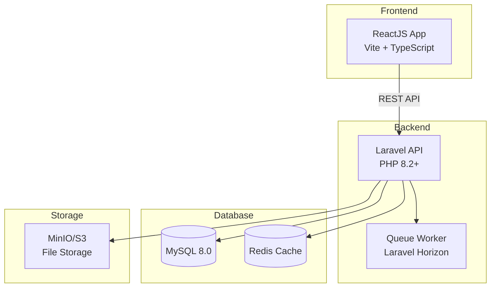

# 📚 Tài liệu Hệ thống Quản lý Thi Trắc nghiệm

## 📋 Tổng quan

Đây là tài liệu kỹ thuật toàn diện cho hệ thống quản lý thi trắc nghiệm trực tuyến. Hệ thống được xây dựng bằng **PHP Laravel** (Backend), **ReactJS** (Frontend), **MySQL** (Database), và được triển khai qua **Podman containers**.

---

## 🎯 Mục tiêu hệ thống

- **Quản lý ngân hàng câu hỏi** cho các môn học với phân loại theo chương, độ khó
- **Tạo đề thi tự động** từ ngân hàng câu hỏi với các tùy chọn đảo câu hỏi, đảo đáp án
- **Quản lý nhóm học phần** với chức năng điểm danh bằng mã QR
- **Phân công giảng dạy** cho giảng viên theo môn học
- **Tổ chức thi trực tuyến** với theo dõi thời gian và kết quả
- **Xuất/nhập dữ liệu** câu hỏi, điểm số theo nhiều định dạng

---

## 🏗️ Kiến trúc hệ thống



---

## 📁 Cấu trúc thư mục tài liệu

```
docs/
├── README.md                    # File này - Tổng quan tài liệu
├── ROADMAP.md                   # Lộ trình phát triển tổng thể
│
├── database/                    # Tài liệu cơ sở dữ liệu
│   ├── schema.sql              # Script tạo database hoàn chỉnh
│   ├── database-design.md      # Thiết kế và mô tả CSDL
│   └── erd.md                  # Entity Relationship Diagram
│
├── api/                         # Tài liệu API
│   ├── openapi.yaml            # OpenAPI 3.0 Specification
│   └── endpoints.md            # Mô tả chi tiết các endpoints
│
├── features/                    # Tài liệu chức năng chi tiết
│   ├── course-groups.md        # Quản lý nhóm học phần
│   ├── questions.md            # Quản lý câu hỏi
│   ├── subjects.md             # Quản lý môn học
│   ├── assignments.md          # Phân công giảng dạy
│   ├── exams.md                # Quản lý đề kiểm tra
│   ├── students.md             # Chức năng sinh viên
│   ├── permissions.md          # Phân quyền người dùng
│   └── import-export.md        # Chức năng import/export
│
├── deployment/                  # Tài liệu triển khai
│   ├── podman-compose.yaml     # Cấu hình Podman containers
│   ├── deployment.md           # Hướng dẫn triển khai
│   └── environment.md          # Cấu hình biến môi trường
│
└── planning/                    # Tài liệu quy hoạch dự án
    ├── sprint-plan.json        # Kế hoạch sprint chi tiết
    └── milestones.md           # Các mốc phát triển chính
```

---

## 👥 Vai trò người dùng

| Vai trò | Mô tả | Quyền hạn chính |
|---------|-------|-----------------|
| **Admin** | Quản trị viên hệ thống | Quản lý người dùng, phân công giảng dạy, cấu hình hệ thống |
| **Giảng viên** | Giáo viên/Giảng viên | Quản lý môn học, câu hỏi, đề thi, nhóm học phần |
| **Sinh viên** | Học sinh/Sinh viên | Làm bài thi, xem kết quả, điểm danh |

---

## 🚀 Bắt đầu nhanh

### Yêu cầu hệ thống

- **OS**: Linux/macOS/Windows với WSL2
- **Podman**: 4.0+
- **Node.js**: 18.0+ (cho development)
- **PHP**: 8.2+ (cho development)
- **Composer**: 2.0+

### Khởi chạy với Podman

```bash
# Clone repository
git clone <repository-url>
cd exam-management-system

# Khởi động containers
cd docs/deployment
podman-compose up -d

# Truy cập ứng dụng
# Frontend: http://localhost:3000
# Backend API: http://localhost:8000
# phpMyAdmin: http://localhost:8080
```

---

## 📖 Mục lục tài liệu chi tiết

### 1. Cơ sở dữ liệu
- [Thiết kế Database](database/database-design.md)
- [SQL Schema](database/schema.sql)

### 2. API Reference
- [OpenAPI Specification](api/openapi.yaml)
- [Endpoints Documentation](api/endpoints.md)

### 3. Chức năng
- [Quản lý nhóm học phần](features/course-groups.md)
- [Quản lý câu hỏi](features/questions.md)
- [Quản lý môn học](features/subjects.md)
- [Phân công giảng dạy](features/assignments.md)
- [Quản lý đề kiểm tra](features/exams.md)
- [Chức năng sinh viên](features/students.md)
- [Phân quyền](features/permissions.md)
- [Import/Export](features/import-export.md)

### 4. Triển khai
- [Hướng dẫn triển khai](deployment/deployment.md)
- [Podman Compose](deployment/podman-compose.yaml)

### 5. Quy hoạch dự án
- [Lộ trình phát triển](ROADMAP.md)
- [Kế hoạch Sprint](planning/sprint-plan.json)
- [Các mốc quan trọng](planning/milestones.md)

---

## 🔧 Công nghệ sử dụng

| Thành phần | Công nghệ | Phiên bản |
|------------|-----------|-----------|
| Frontend | ReactJS + Vite | React 18.x |
| UI Library | Ant Design / Material UI | Latest |
| Backend | Laravel | 11.x |
| Database | MySQL | 8.0 |
| Cache | Redis | 7.x |
| Container | Podman | 4.x |
| API Docs | Swagger/OpenAPI | 3.0 |

---

## 📞 Liên hệ & Hỗ trợ

- **Repository**: [GitHub/GitLab link]
- **Issues**: Sử dụng Issue Tracker để báo lỗi
- **Wiki**: Tài liệu bổ sung trên Wiki

---

*Tài liệu được cập nhật lần cuối: Tháng 01/2026*
