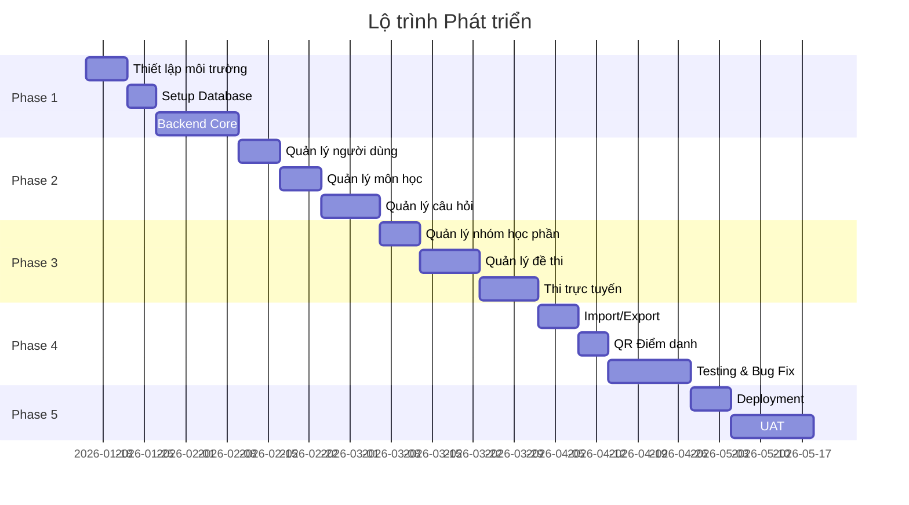

# 🗺️ Lộ trình Phát triển Hệ thống Quản lý Thi Trắc nghiệm

## 📅 Tổng quan Timeline

---

## 🎯 Phase 1: Nền tảng (Tuần 1-4)

### Sprint 1.1: Thiết lập môi trường (Tuần 1)

| Task | Mô tả | Ưu tiên | Thời gian |
|------|-------|---------|-----------|
| DEV-001 | Cấu hình Podman containers | Cao | 2 ngày |
| DEV-002 | Setup Laravel project | Cao | 1 ngày |
| DEV-003 | Setup ReactJS project với Vite | Cao | 1 ngày |
| DEV-004 | Kết nối MySQL database | Cao | 1 ngày |
| DEV-005 | Cấu hình Redis cache | Trung bình | 1 ngày |
| DEV-006 | Setup CI/CD pipeline | Thấp | 1 ngày |

**Deliverables:**
- ✅ Docker/Podman environment hoạt động
- ✅ Laravel API running
- ✅ React frontend running
- ✅ Database connected

### Sprint 1.2: Database Schema (Tuần 2)

| Task | Mô tả | Ưu tiên | Thời gian |
|------|-------|---------|-----------|
| DB-001 | Thiết kế ERD | Cao | 2 ngày |
| DB-002 | Tạo migrations cho users, roles | Cao | 1 ngày |
| DB-003 | Tạo migrations cho subjects, chapters | Cao | 1 ngày |
| DB-004 | Tạo migrations cho questions, answers | Cao | 1 ngày |

**Deliverables:**
- ✅ Complete database schema
- ✅ All migrations created
- ✅ Seeders for testing data

### Sprint 1.3: Backend Core & Authentication (Tuần 3-4)

| Task | Mô tả | Ưu tiên | Thời gian |
|------|-------|---------|-----------|
| AUTH-001 | Implement Laravel Sanctum | Cao | 2 ngày |
| AUTH-002 | Login/Register API | Cao | 2 ngày |
| AUTH-003 | Role & Permission system | Cao | 3 ngày |
| AUTH-004 | JWT Token refresh | Trung bình | 1 ngày |
| AUTH-005 | Password reset flow | Trung bình | 2 ngày |
| CORE-001 | Setup API Response format | Cao | 1 ngày |
| CORE-002 | Exception handling | Cao | 1 ngày |
| CORE-003 | Request validation | Cao | 1 ngày |

**Deliverables:**
- ✅ Authentication system working
- ✅ Role-based access control
- ✅ Standardized API responses

---

## 📚 Phase 2: Quản lý Cơ bản (Tuần 5-8)

### Sprint 2.1: Quản lý Người dùng (Tuần 5)

| Task | Mô tả | Ưu tiên | Thời gian |
|------|-------|---------|-----------|
| USER-001 | CRUD Users API | Cao | 2 ngày |
| USER-002 | User profile management | Cao | 1 ngày |
| USER-003 | Avatar upload | Thấp | 1 ngày |
| USER-004 | User list with filters | Cao | 1 ngày |
| USER-005 | Frontend: User management pages | Cao | 2 ngày |

### Sprint 2.2: Quản lý Môn học (Tuần 6)

| Task | Mô tả | Ưu tiên | Thời gian |
|------|-------|---------|-----------|
| SUBJ-001 | CRUD Subjects API | Cao | 2 ngày |
| SUBJ-002 | CRUD Chapters API | Cao | 2 ngày |
| SUBJ-003 | Teaching materials upload | Trung bình | 1 ngày |
| SUBJ-004 | Frontend: Subject management | Cao | 2 ngày |

### Sprint 2.3: Phân công Giảng dạy (Tuần 7)

| Task | Mô tả | Ưu tiên | Thời gian |
|------|-------|---------|-----------|
| ASGN-001 | Assignment CRUD API | Cao | 2 ngày |
| ASGN-002 | Lecturer-Subject mapping | Cao | 2 ngày |
| ASGN-003 | Frontend: Assignment management | Cao | 3 ngày |

### Sprint 2.4: Quản lý Câu hỏi (Tuần 8-9)

| Task | Mô tả | Ưu tiên | Thời gian |
|------|-------|---------|-----------|
| QUES-001 | CRUD Questions API | Cao | 3 ngày |
| QUES-002 | Multiple choice answers | Cao | 2 ngày |
| QUES-003 | True/False questions | Cao | 1 ngày |
| QUES-004 | Question filtering (subject, chapter, difficulty) | Cao | 2 ngày |
| QUES-005 | Image attachment for questions | Trung bình | 1 ngày |
| QUES-006 | Frontend: Question bank pages | Cao | 3 ngày |

---

## 🎓 Phase 3: Chức năng Chính (Tuần 10-15)

### Sprint 3.1: Quản lý Nhóm Học phần (Tuần 10-11)

| Task | Mô tả | Ưu tiên | Thời gian |
|------|-------|---------|-----------|
| CG-001 | CRUD Course Groups API | Cao | 2 ngày |
| CG-002 | Student enrollment | Cao | 2 ngày |
| CG-003 | Student list view | Cao | 1 ngày |
| CG-004 | Hide/Archive course group | Trung bình | 1 ngày |
| CG-005 | Frontend: Course group pages | Cao | 3 ngày |

### Sprint 3.2: QR Điểm danh (Tuần 11)

| Task | Mô tả | Ưu tiên | Thời gian |
|------|-------|---------|-----------|
| QR-001 | Generate QR code API | Cao | 2 ngày |
| QR-002 | Attendance check-in API | Cao | 1 ngày |
| QR-003 | Attendance history | Cao | 1 ngày |
| QR-004 | Frontend: QR display & scanner | Cao | 2 ngày |

### Sprint 3.3: Quản lý Đề Kiểm tra (Tuần 12-13)

| Task | Mô tả | Ưu tiên | Thời gian |
|------|-------|---------|-----------|
| EXAM-001 | CRUD Exams API | Cao | 2 ngày |
| EXAM-002 | Auto-generate from question bank | Cao | 3 ngày |
| EXAM-003 | Shuffle questions | Cao | 1 ngày |
| EXAM-004 | Shuffle answers | Cao | 1 ngày |
| EXAM-005 | Exam scheduling | Cao | 2 ngày |
| EXAM-006 | Frontend: Exam builder | Cao | 4 ngày |

### Sprint 3.4: Thi Trực tuyến (Tuần 14-15)

| Task | Mô tả | Ưu tiên | Thời gian |
|------|-------|---------|-----------|
| TEST-001 | Start exam session | Cao | 2 ngày |
| TEST-002 | Answer submission | Cao | 2 ngày |
| TEST-003 | Timer & auto-submit | Cao | 2 ngày |
| TEST-004 | Result calculation | Cao | 2 ngày |
| TEST-005 | Result display | Cao | 1 ngày |
| TEST-006 | Frontend: Exam taking interface | Cao | 4 ngày |

---

## 🔄 Phase 4: Chức năng Nâng cao (Tuần 16-19)

### Sprint 4.1: Import/Export (Tuần 16-17)

| Task | Mô tả | Ưu tiên | Thời gian |
|------|-------|---------|-----------|
| IE-001 | Import questions from Excel | Cao | 3 ngày |
| IE-002 | Import questions from Word | Cao | 3 ngày |
| IE-003 | Export questions to Excel | Cao | 2 ngày |
| IE-004 | Export results to Excel | Cao | 2 ngày |
| IE-005 | Import student list | Cao | 2 ngày |

### Sprint 4.2: Chức năng Sinh viên (Tuần 17-18)

| Task | Mô tả | Ưu tiên | Thời gian |
|------|-------|---------|-----------|
| STU-001 | Student dashboard | Cao | 2 ngày |
| STU-002 | View enrolled courses | Cao | 1 ngày |
| STU-003 | View available exams | Cao | 1 ngày |
| STU-004 | View exam results & history | Cao | 2 ngày |
| STU-005 | QR code scanning for attendance | Cao | 2 ngày |

### Sprint 4.3: Thống kê & Báo cáo (Tuần 18-19)

| Task | Mô tả | Ưu tiên | Thời gian |
|------|-------|---------|-----------|
| RPT-001 | Exam statistics | Trung bình | 2 ngày |
| RPT-002 | Student performance reports | Trung bình | 2 ngày |
| RPT-003 | Question difficulty analysis | Thấp | 2 ngày |
| RPT-004 | Charts and visualizations | Trung bình | 2 ngày |

---

## 🧪 Phase 5: Testing & Deployment (Tuần 20-24)

### Sprint 5.1: Testing (Tuần 20-21)

| Task | Mô tả | Ưu tiên | Thời gian |
|------|-------|---------|-----------|
| QA-001 | Unit tests for APIs | Cao | 3 ngày |
| QA-002 | Integration tests | Cao | 3 ngày |
| QA-003 | Frontend component tests | Trung bình | 2 ngày |
| QA-004 | E2E tests with Playwright | Trung bình | 4 ngày |

### Sprint 5.2: Bug Fixing (Tuần 22)

| Task | Mô tả | Ưu tiên | Thời gian |
|------|-------|---------|-----------|
| BUG-001 | Critical bug fixes | Cao | 5 ngày |
| BUG-002 | Performance optimization | Trung bình | 2 ngày |

### Sprint 5.3: Deployment (Tuần 23)

| Task | Mô tả | Ưu tiên | Thời gian |
|------|-------|---------|-----------|
| DEPLOY-001 | Production Podman setup | Cao | 2 ngày |
| DEPLOY-002 | SSL/HTTPS configuration | Cao | 1 ngày |
| DEPLOY-003 | Backup & restore setup | Cao | 1 ngày |
| DEPLOY-004 | Monitoring setup | Trung bình | 1 ngày |

### Sprint 5.4: UAT (Tuần 24)

| Task | Mô tả | Ưu tiên | Thời gian |
|------|-------|---------|-----------|
| UAT-001 | User acceptance testing | Cao | 5 ngày |
| UAT-002 | Documentation updates | Trung bình | 2 ngày |
| UAT-003 | Training materials | Trung bình | 2 ngày |

---

## 📊 Tóm tắt Milestones

| Milestone | Dự kiến hoàn thành | Deliverables |
|-----------|-------------------|--------------|
| **M1: Foundation** | Tuần 4 | Environment, Database, Auth hoạt động |
| **M2: Basic Management** | Tuần 9 | User, Subject, Question management |
| **M3: Core Features** | Tuần 15 | Course groups, Exams, Online testing |
| **M4: Advanced** | Tuần 19 | Import/Export, Student features, Reports |
| **M5: Release** | Tuần 24 | Production deployment, UAT complete |

---

## ⚠️ Rủi ro & Biện pháp Giảm thiểu

| Rủi ro | Mức độ | Biện pháp |
|--------|--------|-----------|
| Thay đổi yêu cầu | Cao | Agile approach, sprint reviews |
| Vấn đề hiệu năng với nhiều người dùng | Trung bình | Load testing sớm, Redis caching |
| Tích hợp hệ thống khác | Trung bình | API documentation, versioning |
| Bảo mật dữ liệu | Cao | Security audit, penetration testing |

---

## 📈 Metrics & KPIs

- **Sprint Velocity**: Số story points hoàn thành mỗi sprint
- **Bug Rate**: Số bugs/1000 LOC
- **Test Coverage**: Tối thiểu 80%
- **API Response Time**: < 200ms cho 95% requests
- **Uptime**: 99.5%

---

*Cập nhật lần cuối: Tháng 01/2026*
