# EMS - Examination Management System

## Mô Tả Thiết Kế Cơ Sở Dữ Liệu (Schema v3.0)

> **Database Engine:** MySQL 8+  
> **Charset:** utf8mb4 (hỗ trợ tiếng Việt + emoji)  
> **Tổng số bảng:** 23 bảng chính + 5 ALTER deferred (FK, Generated Columns)  
> **Schema Version:** v3.1  
> **Cập nhật:** 2026-02-15  
> **File SQL:** `schema.sql`

---

## Mục Lục

1. [Tổng Quan Kiến Trúc](#1-tổng-quan-kiến-trúc)
2. [Sơ Đồ ERD (Mermaid)](#2-sơ-đồ-erd-mermaid)
3. [Mô Tả Chi Tiết Từng Bảng](#3-mô-tả-chi-tiết-từng-bảng)
4. [Các Nguyên Tắc Thiết Kế](#4-các-nguyên-tắc-thiết-kế)
5. [Lịch Sử Phiên Bản](#5-lịch-sử-phiên-bản)

---

## 1. Tổng Quan Kiến Trúc

Hệ thống chia làm **7 nhóm chức năng chính**, mỗi nhóm gồm các bảng liên quan:

| # | Nhóm | Bảng | Mô tả |
|---|------|------|-------|
| A | **Người dùng & Phân quyền** | `users`, `roles`, `user_roles` | Quản lý tài khoản, phân quyền RBAC N-N. 1 user có thể giữ nhiều vai trò. |
| B | **Học vụ** | `semesters`, `subjects`, `chapters`, `course_sections`, `class_schedules`, `course_section_students` | Quản lý môn học, chương, lớp học phần, thời khoá biểu, sinh viên đăng ký. |
| C | **Ngân hàng Câu hỏi** | `question_types`, `questions`, `question_options`, `question_tags` | Câu hỏi đa dạng loại (MCQ, T/F, điền chỗ trống, ghép cặp, tự luận), phân loại theo chương/mức độ Bloom. |
| D | **Đề thi & Thi cử** | `exam_papers`, `exam_paper_questions`, `exam_schedules`, `exam_attempts`, `exam_answers`, `exam_attempt_events` | Tạo đề → Snapshot → Lên lịch → SV thi → Chấm điểm → Log chống gian lận. |
| E | **Điểm danh** | `attendance_sessions`, `attendance_records` | Điểm danh thủ công / QR / PIN, kiểm tra GPS chống điểm danh từ xa. |
| F | **Tài liệu** | `syllabi`, `documents`, `files` | Đề cương, tài liệu học tập, quản lý file tập trung. |
| G | **Hệ thống** | `notifications`, `activity_logs`, `settings` | Thông báo, nhật ký hoạt động, cấu hình runtime. |

---

## 2. Sơ Đồ ERD (Mermaid)

```mermaid
erDiagram
    %% ════════════════════════════════════════
    %% NHÓM A: NGƯỜI DÙNG & PHÂN QUYỀN
    %% ════════════════════════════════════════

    users {
        BIGINT id PK
        VARCHAR name
        VARCHAR email UK
        VARCHAR password
        VARCHAR phone
        BIGINT avatar_file_id FK
        VARCHAR student_code UK
        VARCHAR lecturer_code UK
        VARCHAR class_name
        VARCHAR department
        TINYINT is_active
        TIMESTAMP deleted_at
    }

    roles {
        BIGINT id PK
        VARCHAR code UK
        VARCHAR name
        TEXT description
        TINYINT is_active
    }

    user_roles {
        BIGINT id PK
        BIGINT user_id FK
        BIGINT role_id FK
        TIMESTAMP assigned_at
    }

    users ||--o{ user_roles : "has roles"
    roles ||--o{ user_roles : "assigned to"

    %% ════════════════════════════════════════
    %% NHÓM B: HỌC VỤ
    %% ════════════════════════════════════════

    semesters {
        BIGINT id PK
        VARCHAR name
        SMALLINT year
        TINYINT term
        DATE start_date
        DATE end_date
        TINYINT is_current
    }

    subjects {
        BIGINT id PK
        VARCHAR code UK
        VARCHAR name
        TINYINT credits
        VARCHAR department
        TEXT description
        TIMESTAMP deleted_at
    }

    chapters {
        BIGINT id PK
        BIGINT subject_id FK
        VARCHAR name
        INT order_num
    }

    course_sections {
        BIGINT id PK
        VARCHAR code UK
        BIGINT subject_id FK
        BIGINT semester_id FK
        BIGINT lecturer_id FK
        INT max_students
        ENUM status
    }

    class_schedules {
        BIGINT id PK
        BIGINT course_section_id FK
        TINYINT day_of_week
        TINYINT start_period
        TINYINT end_period
        VARCHAR room
    }

    course_section_students {
        BIGINT id PK
        BIGINT course_section_id FK
        BIGINT student_id FK
        ENUM status
        TIMESTAMP enrolled_at
    }

    subjects ||--o{ chapters : "has"
    subjects ||--o{ course_sections : "opens"
    semesters ||--o{ course_sections : "belongs to"
    users ||--o{ course_sections : "teaches"
    course_sections ||--o{ class_schedules : "schedule"
    course_sections ||--o{ course_section_students : "enrolls"
    users ||--o{ course_section_students : "registers"

    %% ════════════════════════════════════════
    %% NHÓM C: NGÂN HÀNG CÂU HỎI
    %% ════════════════════════════════════════

    question_types {
        BIGINT id PK
        VARCHAR code UK
        VARCHAR name
        JSON answer_schema
        TINYINT is_auto_grade
    }

    questions {
        BIGINT id PK
        BIGINT subject_id FK
        BIGINT chapter_id FK
        BIGINT question_type_id FK
        BIGINT created_by FK
        TEXT content
        ENUM difficulty
        BIGINT image_file_id FK
        JSON answer_data
        ENUM status
        INT version
        DECIMAL correct_rate
        TIMESTAMP deleted_at
    }

    question_options {
        BIGINT id PK
        BIGINT question_id FK
        CHAR label
        TEXT content
        BIGINT image_file_id FK
        TINYINT is_correct
        TINYINT order_num
    }

    question_tags {
        BIGINT id PK
        BIGINT question_id FK
        VARCHAR tag
    }

    question_types ||--o{ questions : "categorizes"
    subjects ||--o{ questions : "belongs to"
    chapters ||--o{ questions : "grouped by"
    users ||--o{ questions : "created by"
    questions ||--o{ question_options : "has options"
    questions ||--o{ question_tags : "tagged"

    %% ════════════════════════════════════════
    %% NHÓM D: ĐỀ THI & THI CỬ
    %% ════════════════════════════════════════

    exam_papers {
        BIGINT id PK
        BIGINT subject_id FK
        BIGINT created_by FK
        VARCHAR title
        INT total_questions
        DECIMAL total_marks
        TINYINT shuffle_questions
        TINYINT shuffle_options
        ENUM show_result
        ENUM mode
        ENUM status
        DATETIME published_at
        TIMESTAMP deleted_at
    }

    exam_paper_questions {
        BIGINT id PK
        BIGINT exam_paper_id FK
        BIGINT question_id FK
        INT order_num
        DECIMAL marks
        JSON content_snapshot
    }

    exam_schedules {
        BIGINT id PK
        BIGINT exam_paper_id FK
        BIGINT course_section_id FK
        BIGINT scheduled_by FK
        INT duration_minutes
        TINYINT max_attempts
        DATETIME start_time
        DATETIME end_time
        DECIMAL pass_score
        VARCHAR password
        ENUM status
    }

    exam_attempts {
        BIGINT id PK
        BIGINT exam_schedule_id FK
        BIGINT student_id FK
        TINYINT attempt_number
        DATETIME started_at
        DATETIME submitted_at
        INT duration_seconds
        DECIMAL score
        INT total_correct
        JSON questions_order
        ENUM status
    }

    exam_answers {
        BIGINT id PK
        BIGINT exam_attempt_id FK
        BIGINT exam_paper_question_id FK
        TINYINT selected_snapshot_index
        CHAR selected_snapshot_label
        TINYINT is_correct
        TINYINT is_flagged
        TEXT answer_text
        JSON answer_data
        JSON displayed_options_order
    }

    exam_attempt_events {
        BIGINT id PK
        BIGINT exam_attempt_id FK
        VARCHAR event_type
        JSON event_data
        DATETIME occurred_at
        TIMESTAMP received_at
    }

    subjects ||--o{ exam_papers : "has exams"
    users ||--o{ exam_papers : "created by"
    exam_papers ||--o{ exam_paper_questions : "contains"
    questions ||--o{ exam_paper_questions : "snapshot of"
    exam_papers ||--o{ exam_schedules : "scheduled as"
    course_sections ||--o{ exam_schedules : "assigned to"
    exam_schedules ||--o{ exam_attempts : "taken in"
    users ||--o{ exam_attempts : "student"
    exam_attempts ||--o{ exam_answers : "responses"
    exam_paper_questions ||--o{ exam_answers : "answers for"
    exam_attempts ||--o{ exam_attempt_events : "events during"

    %% ════════════════════════════════════════
    %% NHÓM E: ĐIỂM DANH
    %% ════════════════════════════════════════

    attendance_sessions {
        BIGINT id PK
        BIGINT course_section_id FK
        BIGINT created_by FK
        DATE session_date
        ENUM method
        VARCHAR qr_code
        VARCHAR pin_code
        DATETIME expires_at
        DECIMAL latitude
        DECIMAL longitude
        ENUM status
    }

    attendance_records {
        BIGINT id PK
        BIGINT attendance_session_id FK
        BIGINT student_id FK
        ENUM status
        DATETIME checked_at
        DECIMAL student_latitude
        DECIMAL student_longitude
        DECIMAL distance_meters
    }

    course_sections ||--o{ attendance_sessions : "has sessions"
    attendance_sessions ||--o{ attendance_records : "records"
    users ||--o{ attendance_records : "checked in"

    %% ════════════════════════════════════════
    %% NHÓM F: TÀI LIỆU & FILE
    %% ════════════════════════════════════════

    files {
        BIGINT id PK
        BIGINT uploaded_by FK
        VARCHAR disk
        VARCHAR path
        VARCHAR original_name
        VARCHAR mime_type
        VARCHAR extension
        BIGINT size
        VARCHAR checksum
        TINYINT is_public
        VARCHAR used_by_type
        BIGINT used_by_id
        TIMESTAMP deleted_at
    }

    syllabi {
        BIGINT id PK
        BIGINT subject_id FK
        BIGINT created_by FK
        VARCHAR title
        LONGTEXT content
        BIGINT file_id FK
        VARCHAR version
        ENUM status
    }

    documents {
        BIGINT id PK
        BIGINT subject_id FK
        BIGINT chapter_id FK
        BIGINT uploaded_by FK
        BIGINT file_id FK
        VARCHAR title
        INT download_count
        ENUM status
        TIMESTAMP deleted_at
    }

    users ||--o{ files : "uploads"
    files ||--o| users : "avatar"
    files ||--o| questions : "image"
    files ||--o| question_options : "image"
    subjects ||--o{ syllabi : "has syllabus"
    files ||--o| syllabi : "attachment"
    subjects ||--o{ documents : "has docs"
    chapters ||--o{ documents : "filed under"
    files ||--o| documents : "stores"

    %% ════════════════════════════════════════
    %% NHÓM G: HỆ THỐNG
    %% ════════════════════════════════════════

    notifications {
        CHAR_36 id PK
        BIGINT user_id FK
        VARCHAR type
        VARCHAR title
        TEXT message
        JSON data
        DATETIME read_at
    }

    activity_logs {
        BIGINT id PK
        BIGINT user_id FK
        VARCHAR action
        VARCHAR model_type
        BIGINT model_id
        JSON old_values
        JSON new_values
    }

    settings {
        BIGINT id PK
        VARCHAR key_name UK
        TEXT value_text
        VARCHAR description
    }

    users ||--o{ notifications : "receives"
    users ||--o{ activity_logs : "performed"
```



---

## 3. Mô Tả Chi Tiết Từng Bảng

### NHÓM A — Người Dùng & Phân Quyền

#### 3.1. `users` — Người dùng

Bảng trung tâm lưu thông tin tất cả người dùng hệ thống. Mọi loại tài khoản (admin, giảng viên, sinh viên, trợ giảng...) đều nằm chung **một bảng duy nhất**.

| Cột | Kiểu | Mô tả |
|-----|------|-------|
| `id` | BIGINT PK | ID tự tăng |
| `name` | VARCHAR(255) | Họ và tên |
| `email` | VARCHAR(255) UNIQUE | Email đăng nhập |
| `password` | VARCHAR(255) | Mật khẩu (bcrypt hash) |
| `phone` | VARCHAR(20) | Số điện thoại |
| `avatar_file_id` | BIGINT FK → `files` | Ảnh đại diện (quản lý qua bảng `files`) |
| `student_code` | VARCHAR(20) UNIQUE | Mã sinh viên (MSSV), NULL nếu không phải SV |
| `lecturer_code` | VARCHAR(20) UNIQUE | Mã giảng viên, NULL nếu không phải GV |
| `class_name` | VARCHAR(100) | Lớp sinh hoạt (chỉ dành cho SV) |
| `department` | VARCHAR(255) | Khoa / Bộ môn |
| `is_active` | TINYINT(1) | 1 = Hoạt động, 0 = Bị khoá |
| `email_verified_at` | TIMESTAMP | Thời điểm xác minh email |
| `remember_token` | VARCHAR(100) | Token "Remember Me" của Laravel |
| `deleted_at` | TIMESTAMP | Soft Delete — xoá logic, dữ liệu vẫn tồn tại trong DB |

**Tại sao dùng 1 bảng thay vì tách `admins`, `lecturers`, `students`?**
- Các loại người dùng chia sẻ ~80% thuộc tính giống nhau → tách bảng gây trùng lặp.
- Laravel Auth mặc định hoạt động với 1 bảng `users` → dễ triển khai, dễ bảo trì.
- Các cột riêng biệt (`student_code`, `lecturer_code`) cho phép NULL — không lãng phí vì MySQL không tốn dung lượng cho NULL.
- Soft Delete bắt buộc vì sinh viên có thể liên kết tới dữ liệu thi, điểm danh — không thể xoá cứng.

---

#### 3.2. `roles` — Vai trò

Bảng tham chiếu chứa danh sách các vai trò trong hệ thống. Thay thế cho cột `role ENUM(...)` cứng nhắc trong bảng `users`.

| Cột | Kiểu | Mô tả |
|-----|------|-------|
| `id` | BIGINT PK | ID tự tăng |
| `code` | VARCHAR(50) UNIQUE | Mã vai trò: `admin`, `lecturer`, `student`, `teaching_assistant`... |
| `name` | VARCHAR(100) | Tên hiển thị: "Quản trị viên", "Giảng viên"... |
| `description` | TEXT | Mô tả quyền hạn |
| `is_active` | TINYINT(1) | Có đang sử dụng không |

**Tại sao không dùng ENUM?**
- ENUM cứng: thêm vai trò mới = `ALTER TABLE` = rủi ro table locking trên production.
- Bảng tham chiếu: thêm vai trò = `INSERT INTO roles` = không downtime, không migration.

**Dữ liệu mặc định:**

| id | code | name |
|----|------|------|
| 1 | `admin` | Quản trị viên |
| 2 | `lecturer` | Giảng viên |
| 3 | `student` | Sinh viên |
| 4 | `teaching_assistant` | Trợ giảng |
| 5 | `department_admin` | Admin khoa |

---

#### 3.3. `user_roles` — Gán vai trò (N-N)

Bảng trung gian (pivot) thực hiện quan hệ Nhiều-Nhiều giữa `users` và `roles`. **Một người có thể có nhiều vai trò cùng lúc.**

| Cột | Kiểu | Mô tả |
|-----|------|-------|
| `user_id` | BIGINT FK → `users` | Người dùng |
| `role_id` | BIGINT FK → `roles` | Vai trò được gán |
| `assigned_at` | TIMESTAMP | Thời điểm gán vai trò |

**Ví dụ thực tế:**
- Nguyễn Văn A vừa là **Sinh viên** (role_id=3) vừa là **Trợ giảng** (role_id=4) → 2 bản ghi trong `user_roles`.
- Admin khoa Trần Thị B vừa là **Admin khoa** (role_id=5) vừa **dạy 2 lớp** nên cần role **Giảng viên** (role_id=2).

**UNIQUE(`user_id`, `role_id`)** đảm bảo không gán trùng vai trò cho 1 người.

---

### NHÓM B — Học Vụ

#### 3.4. `semesters` — Học kỳ

| Cột | Kiểu | Mô tả |
|-----|------|-------|
| `name` | VARCHAR(100) | Tên hiển thị: "HK1 2025-2026" |
| `year` | SMALLINT | Năm học bắt đầu: 2025 |
| `term` | TINYINT | 1 = HK1, 2 = HK2, 3 = HK Hè |
| `start_date` / `end_date` | DATE | Thời gian bắt đầu/kết thúc kỳ |
| `is_current` | TINYINT(1) | Đánh dấu kỳ đang diễn ra |

**Tại sao tách riêng?** Học kỳ là thực thể có vòng đời riêng (ngày bắt đầu, kết thúc). UNIQUE(`year`, `term`) ngăn tạo trùng "HK1 2025" hai lần. Cột `is_current` giúp hệ thống biết ngay kỳ hiện tại mà không cần tính từ ngày.

---

#### 3.5. `subjects` — Môn học

| Cột | Kiểu | Mô tả |
|-----|------|-------|
| `code` | VARCHAR(20) UNIQUE | Mã môn: "CS101" |
| `name` | VARCHAR(255) | Tên: "Nhập môn Lập trình" |
| `credits` | TINYINT | Số tín chỉ |
| `department` | VARCHAR(255) | Khoa quản lý |

**Soft Delete** — không thể xoá cứng vì môn học liên kết tới câu hỏi, đề thi, tài liệu.

---

#### 3.6. `chapters` — Chương (thuộc môn học)

| Cột | Kiểu | Mô tả |
|-----|------|-------|
| `subject_id` | BIGINT FK → `subjects` | Thuộc môn học nào |
| `name` | VARCHAR(255) | Tên chương |
| `order` | INT | Thứ tự sắp xếp |

**Tại sao cần bảng `chapters`?**
- Câu hỏi và tài liệu cần **phân loại theo chương** để tạo đề thi theo ma trận (VD: 5 câu chương 1, 3 câu chương 2...).
- FK `ON DELETE CASCADE`: xoá môn → xoá luôn các chương (chương không có ý nghĩa nếu thiếu môn).

---

#### 3.7. `course_sections` — Lớp học phần

| Cột | Kiểu | Mô tả |
|-----|------|-------|
| `code` | VARCHAR(50) UNIQUE | Mã lớp: "CS101-01-HK1-2526" |
| `subject_id` | BIGINT FK → `subjects` | Môn học |
| `semester_id` | BIGINT FK → `semesters` | Học kỳ |
| `lecturer_id` | BIGINT FK → `users` | Giảng viên phụ trách |
| `max_students` | INT | Sĩ số tối đa |
| `status` | ENUM | `active` / `archived` / `cancelled` |

**Tại sao tách khỏi `subjects`?** Một môn mở nhiều lớp mỗi kỳ (CS101-01, CS101-02...), mỗi lớp có GV, lịch, phòng khác nhau. FK dùng `ON DELETE RESTRICT` → không cho xoá GV/môn/kỳ nếu đang có lớp liên kết.

---

#### 3.8. `class_schedules` — Thời khoá biểu cấu trúc

| Cột | Kiểu | Mô tả |
|-----|------|-------|
| `course_section_id` | BIGINT FK → `course_sections` | Lớp học phần |
| `day_of_week` | TINYINT | 2 = Thứ Hai, 3 = Thứ Ba, ..., 8 = Chủ Nhật |
| `start_period` | TINYINT | Tiết bắt đầu (1-16) |
| `end_period` | TINYINT | Tiết kết thúc (1-16) |
| `room` | VARCHAR(50) | Phòng học |

**Tại sao không lưu `schedule VARCHAR` trong `course_sections`?**

Trước đây, lịch học được lưu kiểu text: `"T2 (1-3), T5 (4-6)"`. Cách này **không thể query** để tìm phòng trống hoặc phát hiện trùng lịch.

Bảng cấu trúc cho phép:

```sql
-- Kiểm tra phòng A101 có trống Thứ 2 tiết 1-3 không?
SELECT * FROM class_schedules
WHERE room = 'A101' AND day_of_week = 2
  AND start_period <= 3 AND end_period >= 1;
```

**CHECK constraint** đảm bảo `start_period <= end_period` và `day_of_week` nằm trong khoảng 2-8.

---

#### 3.9. `course_section_students` — Đăng ký lớp học phần (N-N)

Bảng pivot N-N giữa `users` (sinh viên) và `course_sections`.

| Cột | Kiểu | Mô tả |
|-----|------|-------|
| `course_section_id` | BIGINT FK → `course_sections` | Lớp học phần |
| `student_id` | BIGINT FK → `users` | Sinh viên |
| `status` | ENUM | `enrolled` (đang học) / `dropped` (đã rút) / `completed` (hoàn thành) |
| `enrolled_at` | TIMESTAMP | Thời điểm đăng ký |

- UNIQUE(`course_section_id`, `student_id`) → sinh viên không đăng ký trùng.
- `status` cho phép quản lý rút môn mà vẫn giữ audit trail (không xoá record).
- FK `ON DELETE CASCADE` ở cả 2 phía → xoá lớp hoặc SV thì tự xoá bản ghi đăng ký.

---

### NHÓM C — Ngân Hàng Câu Hỏi

#### 3.10. `question_types` — Loại câu hỏi

Bảng tham chiếu thay thế ENUM cứng, cho phép mở rộng loại câu hỏi mà **không cần ALTER TABLE**.

| Cột | Kiểu | Mô tả |
|-----|------|-------|
| `code` | VARCHAR(50) UNIQUE | Mã loại: `multiple_choice`, `true_false`, `fill_blank`, `matching`, `essay` |
| `name` | VARCHAR(100) | Tên hiển thị |
| `answer_schema` | JSON | JSON Schema mô tả cấu trúc đáp án kỳ vọng |
| `is_auto_grade` | TINYINT(1) | 1 = Chấm tự động, 0 = Cần chấm tay (tự luận) |

**Dữ liệu mặc định:**

| code | Tên | Chấm tự động? | Đáp án lưu ở đâu? |
|------|-----|---------------|-------------------|
| `multiple_choice` | Trắc nghiệm nhiều lựa chọn | Có | `question_options` |
| `multiple_answer` | Trắc nghiệm nhiều đáp án đúng | Có | `question_options` |
| `true_false` | Đúng / Sai | Có | `question_options` |
| `fill_blank` | Điền vào chỗ trống | Có | `questions.answer_data` |
| `matching` | Ghép cặp | Có | `questions.answer_data` |
| `essay` | Tự luận | **Không** | `exam_answers.answer_text` |

**Mở rộng:** Khi muốn thêm dạng "Kéo thả" hay "Code", chỉ cần `INSERT INTO question_types` + viết logic chấm tương ứng. Không đụng tới cấu trúc bảng.

---

#### 3.11. `questions` — Ngân hàng câu hỏi (bảng sống)

Đây là **bảng sống (live)** — nội dung có thể được sửa bất cứ lúc nào bởi giảng viên. Khi đưa câu hỏi vào đề thi và publish, nội dung sẽ được **snapshot** (đóng băng) vào `exam_paper_questions.content_snapshot`.

| Cột | Kiểu | Mô tả |
|-----|------|-------|
| `subject_id` | BIGINT FK → `subjects` | Thuộc môn nào |
| `chapter_id` | BIGINT FK → `chapters` | Thuộc chương nào (tuỳ chọn) |
| `question_type_id` | BIGINT FK → `question_types` | Loại câu hỏi |
| `created_by` | BIGINT FK → `users` | GV tạo câu hỏi |
| `content` | TEXT | Nội dung câu hỏi (hỗ trợ HTML/Markdown) |
| `difficulty` | ENUM | Mức độ Bloom: `remember`, `understand`, `apply`, `analyze` |
| `image_file_id` | BIGINT FK → `files` | Hình ảnh minh hoạ |
| `explanation` | TEXT | Giải thích đáp án đúng |
| `answer_data` | JSON | Đáp án linh hoạt cho fill_blank, matching, essay rubric... |
| `status` | ENUM | `draft` / `approved` / `hidden` |
| `version` | INT | Số phiên bản, tăng mỗi khi nội dung bị sửa |
| `usage_count` | INT | Số lần được đưa vào đề thi |
| `correct_rate` | DECIMAL(5,2) | Tỷ lệ % SV trả lời đúng (cập nhật sau mỗi kỳ thi) |

**Index quan trọng:** `idx_questions_matrix`(`subject_id`, `chapter_id`, `difficulty`, `status`) — composite index phục vụ **tạo đề tự động theo ma trận** (VD: "Lấy 5 câu chương 1, mức Thông hiểu, trạng thái Approved").

---

#### 3.12. `question_options` — Lựa chọn đáp án (A/B/C/D)

Bảng con chứa các lựa chọn cho câu hỏi trắc nghiệm (MCQ, True/False, Multiple Answer). Các loại câu hỏi khác (fill_blank, matching, essay) **không dùng bảng này** — đáp án nằm trong `questions.answer_data`.

| Cột | Kiểu | Mô tả |
|-----|------|-------|
| `question_id` | BIGINT FK → `questions` | Thuộc câu hỏi nào |
| `label` | CHAR(1) | Nhãn: A, B, C, D |
| `content` | TEXT | Nội dung đáp án |
| `image_file_id` | BIGINT FK → `files` | Hình ảnh đáp án (nếu có) |
| `is_correct` | TINYINT(1) | 1 = Đáp án đúng |
| `order` | TINYINT | Thứ tự hiển thị gốc |

**Tại sao tách riêng?** Nếu lưu `option_a`, `option_b`, `option_c`, `option_d` vào 1 dòng → cứng nhắc, không mở rộng được (câu 5 đáp án, hoặc True/False chỉ 2 đáp án).

FK `ON DELETE CASCADE` — xoá câu hỏi → xoá luôn options.

---

#### 3.13. `question_tags` — Gắn nhãn

Bảng riêng cho phép **tìm kiếm nhanh bằng index** (VD: tìm tất cả câu hỏi có tag "OOP"). JSON column không thể đánh index hiệu quả trong MySQL.

UNIQUE(`question_id`, `tag`) ngăn tag trùng lặp trên cùng 1 câu.

---

### NHÓM D — Đề Thi & Thi Cử

Đây là **lõi nghiệp vụ** phức tạp nhất, gồm 6 bảng tạo thành chuỗi:

```
exam_papers → exam_paper_questions (+ snapshot)
     ↓
exam_schedules (gán vào lớp)
     ↓
exam_attempts (SV bắt đầu thi)
     ↓
exam_answers (từng câu trả lời) + exam_attempt_events (log chống gian lận)
```

#### 3.14. `exam_papers` — Đề thi gốc

Đề thi là thực thể **độc lập với lớp học phần**, gắn với **môn học**. Cho phép tái sử dụng 1 đề cho N lớp mà không duplicate.

| Cột | Kiểu | Mô tả |
|-----|------|-------|
| `subject_id` | BIGINT FK → `subjects` | Đề thuộc môn nào |
| `created_by` | BIGINT FK → `users` | GV tạo đề |
| `title` | VARCHAR(255) | Tiêu đề: "Kiểm tra giữa kỳ - Lập trình C" |
| `total_questions` | INT | Tổng số câu |
| `total_marks` | DECIMAL(5,2) | Tổng điểm (thang 10) |
| `shuffle_questions` | TINYINT(1) | Trộn thứ tự câu hỏi |
| `shuffle_options` | TINYINT(1) | Trộn thứ tự đáp án |
| `show_result` | ENUM | Khi nào SV xem điểm: `immediately` / `after_end` / `never` |
| `show_answer` | TINYINT(1) | Cho SV xem đáp án đúng không |
| `allow_review` | TINYINT(1) | Cho phép quay lại câu trước |
| `mode` | ENUM | `official` (chính thức) / `practice` (luyện tập) |
| `status` | ENUM | `draft` → `published` (snapshot tạo) → `archived` |
| `published_at` | DATETIME | Thời điểm duyệt đề (snapshot tạo lúc này) |

**Tại sao tách khỏi lớp?** Nếu "Lập trình C" có 10 lớp cùng kỳ dùng chung 1 đề, thiết kế cũ phải tạo/clone 10 bản ghi `exams` → dư thừa, khó sửa. Thiết kế mới: tạo 1 `exam_papers` + 10 `exam_schedules`.

---

#### 3.15. `exam_paper_questions` — Câu hỏi trong đề + Snapshot

Bảng N-N giữa đề thi và ngân hàng câu hỏi, đồng thời chứa **snapshot đóng băng** toàn bộ nội dung câu hỏi + đáp án tại thời điểm publish.

| Cột | Kiểu | Mô tả |
|-----|------|-------|
| `exam_paper_id` | BIGINT FK → `exam_papers` | Đề thi |
| `question_id` | BIGINT FK → `questions` | Câu hỏi gốc (truy nguyên) |
| `order` | INT | Thứ tự câu hỏi gốc trong đề |
| `marks` | DECIMAL(4,2) | Điểm cho câu này |
| `content_snapshot` | JSON | **Nội dung đóng băng** — xem chi tiết bên dưới |

**Cấu trúc `content_snapshot` JSON:**

```json
{
  "question_version": 3,
  "question_type_code": "multiple_choice",
  "content": "Trong ngôn ngữ C, hàm nào dùng để cấp phát bộ nhớ động?",
  "image": null,
  "explanation": "malloc() là hàm cấp phát bộ nhớ trong thư viện stdlib.h",
  "difficulty": "understand",
  "options": [
    {"id": 101, "label": "A", "content": "printf()", "is_correct": false},
    {"id": 102, "label": "B", "content": "malloc()", "is_correct": true},
    {"id": 103, "label": "C", "content": "scanf()", "is_correct": false},
    {"id": 104, "label": "D", "content": "strlen()", "is_correct": false}
  ],
  "answer_data": null,
  "snapshotted_at": "2026-02-15 10:30:00"
}
```

**Tại sao cần snapshot?**
- **Kịch bản:** GV tạo câu hỏi A → đưa vào đề thi 1 (đã thi xong) → GV sửa nội dung câu A cho đề thi 2.
- **Không có snapshot:** Lịch sử bài làm của SV trong đề thi 1 bị sai lệch (nội dung xem lại khác lúc thi).
- **Có snapshot:** Nội dung đóng băng tại thời điểm publish. GV sửa câu hỏi gốc thoải mái — đề thi cũ không bị ảnh hưởng.

**Snapshot được tạo 1 lần** khi `exam_papers.status` chuyển từ `draft` → `published`. Sau đó **không bao giờ thay đổi**.

---

#### 3.16. `exam_schedules` — Lịch thi (gán đề cho lớp)

Bảng cầu nối giữa `exam_papers` và `course_sections`. Cho phép **1 đề gán cho N lớp** với thời gian, thời lượng, mật khẩu khác nhau.

| Cột | Kiểu | Mô tả |
|-----|------|-------|
| `exam_paper_id` | BIGINT FK → `exam_papers` | Đề thi nào |
| `course_section_id` | BIGINT FK → `course_sections` | Lớp nào |
| `scheduled_by` | BIGINT FK → `users` | GV lên lịch |
| `duration_minutes` | INT | Thời gian làm bài (có thể khác mỗi lớp) |
| `max_attempts` | TINYINT | Số lần thi tối đa |
| `start_time` / `end_time` | DATETIME | Cửa sổ thời gian mở/đóng |
| `pass_score` | DECIMAL(5,2) | Điểm đạt (NULL = không áp dụng) |
| `password` | VARCHAR(100) | Mật khẩu vào phòng thi (tuỳ chọn) |
| `status` | ENUM | `scheduled` → `active` → `closed` / `cancelled` |

UNIQUE(`exam_paper_id`, `course_section_id`) → 1 đề chỉ gán 1 lần cho 1 lớp.

---

#### 3.17. `exam_attempts` — Lượt thi của sinh viên

Mỗi bản ghi = **1 lượt thi** của 1 sinh viên trong 1 lịch thi.

| Cột | Kiểu | Mô tả |
|-----|------|-------|
| `exam_schedule_id` | BIGINT FK → `exam_schedules` | Lịch thi nào |
| `student_id` | BIGINT FK → `users` | SV nào |
| `attempt_number` | TINYINT | Lần thi thứ mấy |
| `started_at` / `submitted_at` | DATETIME | Thời điểm bắt đầu / nộp bài |
| `duration_seconds` | INT | Thời gian làm bài thực tế (giây), tính bởi server khi nộp bài |
| `score` | DECIMAL(5,2) | Điểm đạt được |
| `total_correct` / `total_answered` | INT | Số câu đúng / đã trả lời |
| `is_passed` | TINYINT(1) | Đạt hay không |
| `ip_address` | VARCHAR(45) | IP khi thi |
| `user_agent` | VARCHAR(500) | Trình duyệt / thiết bị |
| `questions_order` | JSON | **Thứ tự câu hỏi đã hiển thị cho SV** |
| `status` | ENUM | `in_progress` → `submitted` / `auto_submitted` → `graded` |

**`questions_order` (Shuffle Audit Trail):**
Lưu mảng JSON thứ tự `exam_paper_question` IDs đã hiển thị cho SV lượt thi này.
```json
[45, 12, 38, 7, 23]
```
Nghĩa là: câu `EPQ#45` hiện đầu tiên, `EPQ#12` thứ 2, v.v.

UNIQUE(`exam_schedule_id`, `student_id`, `attempt_number`) → kiểm soát chặt số lần thi.

---

#### 3.18. `exam_answers` — Câu trả lời chi tiết

Bảng **tự chứa hoàn toàn (self-contained)**, không có FK nào trỏ về bảng sống (`questions`, `question_options`). Mọi dữ liệu cần thiết để render lại giao diện lúc thi đều nằm ngay trong bảng này + snapshot.

| Cột | Kiểu | Mô tả |
|-----|------|-------|
| `exam_attempt_id` | BIGINT FK → `exam_attempts` | Lượt thi nào |
| `exam_paper_question_id` | BIGINT FK → `exam_paper_questions` | Câu hỏi nào (có snapshot) |
| `selected_snapshot_index` | TINYINT | **Index 0-based** trong mảng `options` của snapshot |
| `selected_snapshot_label` | CHAR(1) | **Nhãn SV thực sự nhìn thấy:** A, B, C, D (theo `displayed_options_order`) |
| `is_correct` | TINYINT(1) | 1 = Đúng, 0 = Sai, NULL = Chưa chấm / Tự luận |
| `is_flagged` | TINYINT(1) | SV đánh dấu câu hỏi để xem lại khi làm bài |
| `answer_text` | TEXT | Câu trả lời dạng text (fill_blank / essay) |
| `answer_data` | JSON | Dữ liệu trả lời linh hoạt (matching, ordering...) |
| `answered_at` | DATETIME | Thời điểm trả lời |
| `displayed_options_order` | JSON | **Mảng snapshot option indexes theo thứ tự hiển thị** |

**Tại sao KHÔNG dùng `selected_option_id` FK?**

Đây là lỗi nghiêm trọng nhất trong phiên bản cũ:

- **Kịch bản:** GV sửa câu hỏi gốc → xoá option ID=100, tạo option mới ID=200. SV thi tuần trước chọn ID=100. Hôm nay tra lại → ID=100 đã mất / nội dung đã khác.
- **Giải pháp:** Cắt đứt hoàn toàn FK với bảng sống. Lưu `selected_snapshot_index` (vị trí trong mảng snapshot) và `selected_snapshot_label` (nhãn A/B/C/D đã hiển thị).

**`displayed_options_order` (Shuffle Audit Trail cho đáp án):**
Lưu mảng snapshot option indexes theo thứ tự SV nhìn thấy:
```json
[2, 0, 3, 1]
```
Nghĩa là: `snapshot.options[2]` hiện ở vị trí A, `snapshot.options[0]` ở B, `snapshot.options[3]` ở C, `snapshot.options[1]` ở D.

→ Kết hợp với `content_snapshot` + `questions_order` + `displayed_options_order` + `selected_snapshot_index`, ta có thể **render lại chính xác 100%** giao diện SV đã nhìn thấy lúc thi, kể cả khi GV đã sửa/xoá câu hỏi gốc.

---

#### 3.19. `exam_attempt_events` — Log chống gian lận (Proctoring)

Bảng chuyên biệt ghi log realtime từ client-side trong suốt quá trình thi. **Tách riêng** khỏi `activity_logs` vì:
1. **Tần suất write rất cao** — có thể nhiều event/giây
2. **Retention policy khác** — có thể xoá sau 1 năm, trong khi audit log giữ vĩnh viễn
3. **Query pattern khác** — dashboard GV aggregate theo attempt + type

| Cột | Kiểu | Mô tả |
|-----|------|-------|
| `exam_attempt_id` | BIGINT FK → `exam_attempts` | Lượt thi nào |
| `event_type` | VARCHAR(50) | Loại sự kiện |
| `event_data` | JSON | Metadata bổ sung |
| `ip_address` | VARCHAR(45) | IP |
| `occurred_at` | DATETIME | Timestamp **client-side** |
| `received_at` | TIMESTAMP | Timestamp **server-side** |

**Các `event_type` được hỗ trợ:**

| event_type | Mô tả |
|-----------|-------|
| `tab_switch` | SV rời khỏi tab thi |
| `window_blur` | Cửa sổ trình duyệt mất focus |
| `copy` / `paste` | Copy hoặc Paste nội dung |
| `resize` | Thay đổi kích thước cửa sổ |
| `fullscreen_exit` | Thoát chế độ toàn màn hình |
| `devtools_open` | Mở DevTools trình duyệt |
| `disconnect` / `reconnect` | Mất / khôi phục kết nối mạng |
| `screenshot_attempt` | Cố chụp màn hình |

**2 cột timestamp:** `occurred_at` (client) vs `received_at` (server) → so sánh để phát hiện timestamp giả mạo.

---

### NHÓM E — Điểm Danh

#### 3.20. `attendance_sessions` — Buổi điểm danh

Mỗi bản ghi = **1 buổi điểm danh** của 1 lớp học phần.

| Cột | Kiểu | Mô tả |
|-----|------|-------|
| `course_section_id` | BIGINT FK → `course_sections` | Lớp nào |
| `created_by` | BIGINT FK → `users` | GV tạo buổi điểm danh |
| `session_date` | DATE | Ngày điểm danh |
| `title` | VARCHAR(255) | VD: "Buổi 1 - Giới thiệu môn học" |
| `method` | ENUM | `manual` / `qr_code` / `pin_code` |
| `qr_code` / `pin_code` | VARCHAR | Mã QR hoặc PIN |
| `expires_at` | DATETIME | Thời hạn hết hiệu lực |
| `latitude` / `longitude` | DECIMAL | **Vị trí GPS của GV** (toạ độ lớp học) |
| `status` | ENUM | `open` / `closed` |

---

#### 3.21. `attendance_records` — Bản ghi điểm danh + GPS sinh viên

| Cột | Kiểu | Mô tả |
|-----|------|-------|
| `attendance_session_id` | BIGINT FK → `attendance_sessions` | Buổi nào |
| `student_id` | BIGINT FK → `users` | SV nào |
| `status` | ENUM | `present` / `absent_excused` / `absent_unexcused` / `late` |
| `checked_at` | DATETIME | Thời điểm SV điểm danh |
| `student_latitude` / `student_longitude` | DECIMAL | **Vị trí GPS của SV** lúc điểm danh |
| `distance_meters` | DECIMAL(10,2) | **Khoảng cách** (m) giữa SV và GV, tính bởi server |
| `note` | VARCHAR(255) | Ghi chú (lý do vắng...) |

**Tại sao cần GPS sinh viên?**

- **Kịch bản gian lận:** SV ngồi quán cafe, nhờ bạn chụp QR gửi Zalo → quét → điểm danh thành công.
- **Giải pháp:** Server so sánh `student_latitude/longitude` với `attendance_sessions.latitude/longitude` bằng Haversine formula → tính `distance_meters`. Nếu > ngưỡng (`settings.attendance_geo_radius_m`, mặc định 100m) → reject hoặc flag cảnh báo.

UNIQUE(`attendance_session_id`, `student_id`) → mỗi SV chỉ có 1 trạng thái/buổi.

---

### NHÓM F — Tài Liệu & Quản Lý File

#### 3.22. `files` — Quản lý file tập trung

Mọi file upload trong hệ thống (avatar, hình ảnh câu hỏi, tài liệu, đề cương...) đều đi qua bảng này. Các bảng khác chỉ tham chiếu `file_id` thay vì lưu path rời rạc.

| Cột | Kiểu | Mô tả |
|-----|------|-------|
| `uploaded_by` | BIGINT FK → `users` | Người upload (NULL = hệ thống) |
| `disk` | VARCHAR(20) | Storage disk: `local`, `s3`, `minio` |
| `path` | VARCHAR(500) | Đường dẫn trên disk |
| `original_name` | VARCHAR(255) | Tên file gốc người dùng upload |
| `mime_type` | VARCHAR(100) | MIME type: `application/pdf`, `image/png`... |
| `extension` | VARCHAR(20) | Phần mở rộng: `pdf`, `docx`, `png`... |
| `size` | BIGINT | Dung lượng (bytes) |
| `checksum` | VARCHAR(64) | SHA-256 hash — phát hiện file trùng lặp |
| `is_public` | TINYINT(1) | 1 = Public URL, 0 = Cần signed URL |
| `used_by_type` | VARCHAR(100) | Polymorphic: `App\Models\Document`, `App\Models\Question`... |
| `used_by_id` | BIGINT | ID bản ghi sử dụng file này |
| `deleted_at` | TIMESTAMP | Soft delete — chờ scheduled job dọn rác |

**Tại sao cần bảng files tập trung?**

Trước đây, `file_path` nằm rải rác ở `documents`, `syllabi`, `questions.image`, `question_options.image`, `users.avatar` → **5 nơi khác nhau**. Hậu quả:
- Dọn orphan files (file không còn ai dùng) cực kỳ khó — phải scan 5 bảng.
- Migrate sang S3 phải sửa logic ở 5 chỗ.
- Không thể phát hiện file trùng lặp (cùng nội dung upload nhiều lần).

Bảng `files` tập trung giải quyết tất cả:
- Dọn orphan: `SELECT * FROM files WHERE deleted_at IS NOT NULL AND used_by_type IS NULL`
- Migrate storage: chỉ cần đổi `disk` column
- Trùng lặp: so sánh `checksum`

**Các bảng tham chiếu `file_id`:**

| Bảng | Cột | FK behavior |
|------|-----|-------------|
| `users` | `avatar_file_id` | ON DELETE SET NULL |
| `questions` | `image_file_id` | ON DELETE SET NULL |
| `question_options` | `image_file_id` | ON DELETE SET NULL |
| `syllabi` | `file_id` | ON DELETE SET NULL |
| `documents` | `file_id` | ON DELETE RESTRICT |

---

#### 3.23. `syllabi` — Đề cương môn học

| Cột | Kiểu | Mô tả |
|-----|------|-------|
| `subject_id` | BIGINT FK → `subjects` | Môn nào |
| `created_by` | BIGINT FK → `users` | GV tạo |
| `title` | VARCHAR(255) | Tiêu đề |
| `content` | LONGTEXT | Nội dung đề cương (HTML/Markdown) |
| `file_id` | BIGINT FK → `files` | File đề cương đính kèm |
| `version` | VARCHAR(20) | Phiên bản: "2025.1" |
| `status` | ENUM | `draft` / `published` |

---

#### 3.24. `documents` — Tài liệu học tập

| Cột | Kiểu | Mô tả |
|-----|------|-------|
| `subject_id` | BIGINT FK → `subjects` | Môn nào |
| `chapter_id` | BIGINT FK → `chapters` | Chương nào (tuỳ chọn) |
| `uploaded_by` | BIGINT FK → `users` | Người upload |
| `file_id` | BIGINT FK → `files` | File tài liệu |
| `title` | VARCHAR(255) | Tiêu đề |
| `download_count` | INT | Số lượt tải |
| `status` | ENUM | `active` / `hidden` |

**Tại sao tách `syllabi` và `documents`?**
- **Đề cương** là nội dung text dài (`LONGTEXT`), có version, gắn với **môn học** (1 môn - nhiều phiên bản).
- **Tài liệu** thiên về file, phân loại theo **chương**, theo dõi lượt tải.
- Query pattern khác nhau hoàn toàn.

---

### NHÓM G — Hệ Thống

#### 3.25. `notifications` — Thông báo

| Cột | Kiểu | Mô tả |
|-----|------|-------|
| `id` | CHAR(36) | UUID (tương thích Laravel Notification) |
| `user_id` | BIGINT FK → `users` | Người nhận |
| `type` | VARCHAR(100) | Loại: `exam_created`, `score_published`, `document_uploaded`... |
| `title` / `message` | VARCHAR / TEXT | Tiêu đề và nội dung |
| `data` | JSON | Metadata bổ sung (link, ID liên quan) |
| `read_at` | DATETIME | NULL = chưa đọc |

Index composite `(user_id, read_at)` → query "thông báo chưa đọc" cực nhanh.

---

#### 3.26. `activity_logs` — Nhật ký hoạt động

Ghi lại **ai làm gì, lúc nào, thay đổi gì** — bắt buộc trong hệ thống thi cử.

| Cột | Kiểu | Mô tả |
|-----|------|-------|
| `user_id` | BIGINT FK → `users` | Người thực hiện (NULL = hệ thống) |
| `action` | VARCHAR(100) | `created`, `updated`, `deleted`, `login`, `logout`... |
| `model_type` | VARCHAR(255) | Model: `App\Models\ExamPaper` |
| `model_id` | BIGINT | ID bản ghi bị tác động |
| `old_values` / `new_values` | JSON | Giá trị trước/sau thay đổi |

FK `ON DELETE SET NULL` → nếu xoá user, log vẫn còn (chỉ mất liên kết). Index composite `(model_type, model_id)` → query nhanh "lịch sử thay đổi của đề thi X".

---

#### 3.27. `settings` — Cấu hình hệ thống

Key-Value store cho cấu hình runtime — Admin thay đổi từ giao diện web mà không cần deploy lại.

| key | value | Mô tả |
|-----|-------|-------|
| `app_name` | EMS - Examination Management System | Tên hệ thống |
| `max_upload_size_mb` | 20 | Dung lượng upload tối đa (MB) |
| `allowed_file_types` | pdf,docx,doc,pptx,... | Loại file được phép |
| `max_absent_allowed` | 3 | Số buổi vắng tối đa |
| `timezone` | Asia/Ho_Chi_Minh | Múi giờ |
| `exam_auto_submit` | 1 | Tự động nộp bài khi hết giờ |
| `attendance_geo_radius_m` | 100 | Bán kính GPS cho điểm danh (mét) |
| `file_storage_disk` | local | Disk mặc định: `local`, `s3`, `minio` |

---

### Deferred Foreign Keys & Generated Columns

Do thứ tự tạo bảng (bảng `files` tạo sau `users`, `questions`...), một số FK được thêm bằng `ALTER TABLE` ở cuối file:

```sql
ALTER TABLE users       ADD CONSTRAINT fk_users_avatar    FK (avatar_file_id)    → files(id);
ALTER TABLE questions   ADD CONSTRAINT fk_questions_image FK (image_file_id)     → files(id);
ALTER TABLE question_options ADD CONSTRAINT fk_qo_image   FK (image_file_id)     → files(id);
```

**Generated Columns (Virtual)** cho hiệu năng JSON:

```sql
-- Đếm nhanh số câu đúng theo đề
ALTER TABLE exam_answers ADD COLUMN _epq_id_correct BIGINT GENERATED ALWAYS AS (
    CASE WHEN is_correct = 1 THEN exam_paper_question_id ELSE NULL END
) VIRTUAL;

-- Index 255 ký tự đầu answer_text cho fill_blank
ALTER TABLE exam_answers ADD COLUMN _answer_text_short VARCHAR(255) GENERATED ALWAYS AS (
    LEFT(COALESCE(answer_text, ''), 255)
) VIRTUAL;
```

Virtual Column = tính on-the-fly, **không tốn disk**, nhưng **có thể đánh index** → query thống kê nhanh trên dữ liệu triệu dòng. Convention: prefix `_` cho generated columns → dev biết không INSERT/UPDATE trực tiếp.

---

## 4. Các Nguyên Tắc Thiết Kế

| Nguyên tắc | Áp dụng |
|---|---|
| **Chuẩn hoá 3NF** | Không lặp dữ liệu. Mỗi thông tin chỉ lưu 1 nơi. |
| **Snapshot Isolation** | Dữ liệu thi cử tự chứa hoàn toàn — sửa câu hỏi gốc không ảnh hưởng lịch sử. |
| **RBAC N-N** | 1 user nhiều role. Mở rộng vai trò không cần ALTER TABLE. |
| **Centralized File Storage** | Mọi file đi qua bảng `files`. Scale sang S3 chỉ đổi `disk`. |
| **Soft Delete** | Bảng quan trọng (`users`, `questions`, `exam_papers`, `documents`, `files`) có `deleted_at`. |
| **Referential Integrity** | Mọi FK đều có `ON DELETE` + `ON UPDATE` phù hợp nghiệp vụ. RESTRICT cho dữ liệu thi. |
| **Index tối ưu** | FK index, composite index cho query phức tạp, virtual column index cho JSON. |
| **UNIQUE constraint** | Ngăn trùng lặp ở mức database: email, mã SV, mã GV, mã lớp, pivot tables. |
| **CHECK constraint** | `start_period <= end_period`, `day_of_week BETWEEN 2 AND 8`. |
| **Audit Trail** | `activity_logs` cho CRUD chung. `exam_attempt_events` cho proctoring realtime. |
| **COMMENT** | Mọi cột và bảng đều có comment tiếng Việt → dev mới đọc hiểu ngay. |
| **utf8mb4** | Hỗ trợ tiếng Việt có dấu + emoji. |

---

## 5. Lịch Sử Phiên Bản

### v1.0 (2026-02-14) — MVP
- 20 bảng cơ bản: users, semesters, subjects, chapters, course_sections, exams, questions, attendance, documents, notifications...
- FK trực tiếp giữa exam_answers → question_options (bảng sống).
- Role bằng ENUM cứng trong users.
- Schedule bằng VARCHAR text.

### v2.0 (2026-02-15) — Architecture Fixes
- **[1] Question Versioning:** Thêm snapshot JSON vào `exam_paper_questions`.
- **[2] Tách Exam:** `exams` → `exam_papers` + `exam_schedules`. Đề thi gắn với môn, không gắn lớp.
- **[3] Question Types:** ENUM → bảng `question_types` + `answer_data` JSON.
- **[4] Shuffle Audit:** Thêm `questions_order`, `displayed_options_order`.

### v3.0 (2026-02-15) — Enterprise Hardening
- **[5] Snapshot Consistency:** Loại bỏ FK `selected_option_id`. Thay bằng `selected_snapshot_index` + `selected_snapshot_label`. Ly hôn hoàn toàn với bảng sống.
- **[6] RBAC N-N:** Bảng `roles` + `user_roles` thay thế cột ENUM. 1 user nhiều role.
- **[7] Structured Schedule:** Bảng `class_schedules` thay VARCHAR. Query trùng lịch/phòng bằng SQL thuần.
- **[8] Student GPS:** `attendance_records` thêm `student_latitude`, `student_longitude`, `distance_meters`.
- **[9] Centralized Files:** Bảng `files` quản lý tập trung. 5 bảng tham chiếu `file_id`.
- **[10] JSON Performance:** Generated Columns + Index cho thống kê nhanh trên triệu dòng.
- **[11] Exam Proctoring:** Bảng `exam_attempt_events` log realtime chống gian lận.

### v3.1 (2026-02-15) — Review & Polish
- **[12] Enrollment Status:** Thêm `status` ENUM(`enrolled`/`dropped`/`completed`) vào `course_section_students`. Quản lý rút môn mà giữ audit trail.
- **[13] Exam Flag:** Thêm `is_flagged` vào `exam_answers` — SV đánh dấu câu hỏi để xem lại.
- **[14] Duration Tracking:** Thêm `duration_seconds` vào `exam_attempts` — thời gian làm bài thực tế.
- **[15] Reserved Keyword Fix:** Đổi `settings.key` → `settings.key_name` — tránh xung đột MySQL reserved keyword.