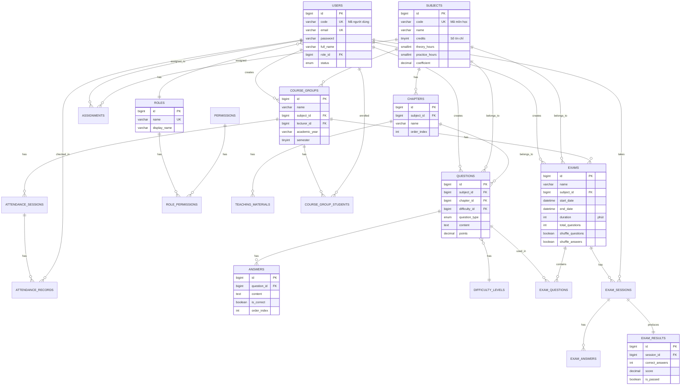

# 📊 Thiết kế Cơ sở Dữ liệu

## 📋 Tổng quan

Cơ sở dữ liệu được thiết kế cho hệ thống quản lý thi trắc nghiệm với các nhóm bảng chính:

1. **Người dùng & Phân quyền**: `users`, `roles`, `permissions`
2. **Môn học & Chương**: `subjects`, `chapters`, `teaching_materials`
3. **Phân công**: `assignments`
4. **Nhóm học phần**: `course_groups`, `course_group_students`
5. **Điểm danh**: `attendance_sessions`, `attendance_records`
6. **Ngân hàng câu hỏi**: `questions`, `answers`, `difficulty_levels`
7. **Đề thi & Kết quả**: `exams`, `exam_questions`, `exam_sessions`, `exam_answers`, `exam_results`
8. **Hệ thống**: `settings`, `activity_logs`, `notifications`, `import_export_jobs`

---

## 🗺️ Entity Relationship Diagram

---

## 📝 Chi tiết các Bảng

### 1. Quản lý Người dùng

#### Bảng `roles`
| Cột | Kiểu | Mô tả |
|-----|------|-------|
| `id` | BIGINT | Primary key |
| `name` | VARCHAR(50) | Tên vai trò: admin, lecturer, student |
| `display_name` | VARCHAR(100) | Tên hiển thị |
| `description` | TEXT | Mô tả vai trò |

#### Bảng `permissions`
| Cột | Kiểu | Mô tả |
|-----|------|-------|
| `id` | BIGINT | Primary key |
| `name` | VARCHAR(100) | Tên quyền: users.create, exams.delete |
| `display_name` | VARCHAR(150) | Tên hiển thị |
| `module` | VARCHAR(50) | Module: users, subjects, exams |

#### Bảng `users`
| Cột | Kiểu | Mô tả |
|-----|------|-------|
| `id` | BIGINT | Primary key |
| `code` | VARCHAR(20) | Mã người dùng (mã GV/SV) - Unique |
| `email` | VARCHAR(255) | Email đăng nhập - Unique |
| `password` | VARCHAR(255) | Mật khẩu mã hóa |
| `full_name` | VARCHAR(150) | Họ và tên |
| `phone` | VARCHAR(20) | Số điện thoại |
| `avatar` | VARCHAR(500) | Đường dẫn ảnh đại diện |
| `gender` | ENUM | male, female, other |
| `date_of_birth` | DATE | Ngày sinh |
| `department` | VARCHAR(200) | Khoa/Phòng ban |
| `role_id` | BIGINT FK | Liên kết đến bảng roles |
| `status` | ENUM | active, inactive, blocked |
| `deleted_at` | TIMESTAMP | Soft delete |

---

### 2. Quản lý Môn học

#### Bảng `subjects`
| Cột | Kiểu | Mô tả |
|-----|------|-------|
| `id` | BIGINT | Primary key |
| `code` | VARCHAR(20) | Mã môn học - Unique |
| `name` | VARCHAR(200) | Tên môn học |
| `credits` | TINYINT | Số tín chỉ |
| `theory_hours` | SMALLINT | Số tiết lý thuyết |
| `practice_hours` | SMALLINT | Số tiết thực hành |
| `coefficient` | DECIMAL(3,2) | Hệ số môn học |
| `status` | ENUM | active, inactive |

#### Bảng `chapters`
| Cột | Kiểu | Mô tả |
|-----|------|-------|
| `id` | BIGINT | Primary key |
| `subject_id` | BIGINT FK | Môn học |
| `code` | VARCHAR(20) | Mã chương |
| `name` | VARCHAR(255) | Tên chương |
| `order_index` | INT | Thứ tự sắp xếp |

#### Bảng `teaching_materials`
| Cột | Kiểu | Mô tả |
|-----|------|-------|
| `id` | BIGINT | Primary key |
| `chapter_id` | BIGINT FK | Thuộc chương |
| `title` | VARCHAR(255) | Tiêu đề tài liệu |
| `file_type` | ENUM | pdf, doc, docx, ppt, pptx, video, link |
| `file_path` | VARCHAR(500) | Đường dẫn file |
| `file_size` | BIGINT | Kích thước file (bytes) |

---

### 3. Phân công Giảng dạy

#### Bảng `assignments`
| Cột | Kiểu | Mô tả |
|-----|------|-------|
| `id` | BIGINT | Primary key |
| `code` | VARCHAR(30) | Mã phân công - Unique |
| `lecturer_id` | BIGINT FK | Giảng viên |
| `subject_id` | BIGINT FK | Môn học |
| `academic_year` | VARCHAR(20) | Năm học: 2025-2026 |
| `semester` | TINYINT | Học kỳ: 1, 2, 3 |
| `assigned_by` | BIGINT FK | Admin phân công |
| `status` | ENUM | active, inactive |

> [!NOTE]
> Mỗi phân công có mã duy nhất, cho phép 1 giảng viên dạy nhiều môn, 1 môn có nhiều giảng viên.

---

### 4. Nhóm Học phần

#### Bảng `course_groups`
| Cột | Kiểu | Mô tả |
|-----|------|-------|
| `id` | BIGINT | Primary key |
| `code` | VARCHAR(30) | Mã nhóm học phần |
| `name` | VARCHAR(200) | Tên nhóm học phần |
| `subject_id` | BIGINT FK | Môn học |
| `lecturer_id` | BIGINT FK | Giảng viên phụ trách |
| `academic_year` | VARCHAR(20) | Năm học |
| `semester` | TINYINT | Học kỳ |
| `note` | TEXT | Ghi chú |
| `max_students` | INT | Số sinh viên tối đa |
| `status` | ENUM | active, hidden, archived |

#### Bảng `course_group_students`
| Cột | Kiểu | Mô tả |
|-----|------|-------|
| `id` | BIGINT | Primary key |
| `course_group_id` | BIGINT FK | Nhóm học phần |
| `student_id` | BIGINT FK | Sinh viên |
| `enrolled_at` | TIMESTAMP | Thời gian đăng ký |
| `status` | ENUM | enrolled, dropped, completed |

---

### 5. Điểm danh

#### Bảng `attendance_sessions`
| Cột | Kiểu | Mô tả |
|-----|------|-------|
| `id` | BIGINT | Primary key |
| `course_group_id` | BIGINT FK | Nhóm học phần |
| `session_name` | VARCHAR(100) | Tên buổi học |
| `session_date` | DATE | Ngày điểm danh |
| `start_time` | TIME | Giờ bắt đầu |
| `end_time` | TIME | Giờ kết thúc |
| `qr_code` | VARCHAR(255) | Mã QR duy nhất |
| `qr_expires_at` | TIMESTAMP | Thời gian hết hạn QR |
| `status` | ENUM | pending, active, closed |

#### Bảng `attendance_records`
| Cột | Kiểu | Mô tả |
|-----|------|-------|
| `id` | BIGINT | Primary key |
| `session_id` | BIGINT FK | Phiên điểm danh |
| `student_id` | BIGINT FK | Sinh viên |
| `checked_in_at` | TIMESTAMP | Thời gian điểm danh |
| `check_in_method` | ENUM | qr_code, manual |
| `status` | ENUM | present, late, absent, excused |

---

### 6. Ngân hàng Câu hỏi

#### Bảng `difficulty_levels`
| Cột | Kiểu | Mô tả |
|-----|------|-------|
| `id` | BIGINT | Primary key |
| `name` | VARCHAR(50) | Tên: Dễ, Trung bình, Khó |
| `code` | VARCHAR(20) | Mã: easy, medium, hard |
| `level` | TINYINT | Cấp độ số: 1, 2, 3 |
| `color` | VARCHAR(20) | Màu hiển thị |

#### Bảng `questions`
| Cột | Kiểu | Mô tả |
|-----|------|-------|
| `id` | BIGINT | Primary key |
| `code` | VARCHAR(30) | Mã câu hỏi |
| `subject_id` | BIGINT FK | Môn học |
| `chapter_id` | BIGINT FK | Chương (nullable) |
| `difficulty_id` | BIGINT FK | Độ khó |
| `question_type` | ENUM | single_choice, multiple_choice, true_false |
| `content` | TEXT | Nội dung câu hỏi |
| `explanation` | TEXT | Giải thích đáp án |
| `image` | VARCHAR(500) | Hình ảnh đính kèm |
| `points` | DECIMAL(5,2) | Điểm câu hỏi |
| `status` | ENUM | active, inactive, draft |

#### Bảng `answers`
| Cột | Kiểu | Mô tả |
|-----|------|-------|
| `id` | BIGINT | Primary key |
| `question_id` | BIGINT FK | Câu hỏi |
| `content` | TEXT | Nội dung đáp án |
| `image` | VARCHAR(500) | Hình ảnh đáp án |
| `is_correct` | TINYINT(1) | Đáp án đúng: 1, sai: 0 |
| `order_index` | INT | Thứ tự hiển thị |

> [!IMPORTANT]
> Mỗi câu hỏi cần tối thiểu 2 đáp án, trong đó ít nhất 1 đáp án đúng.

---

### 7. Đề Kiểm tra

#### Bảng `exams`
| Cột | Kiểu | Mô tả |
|-----|------|-------|
| `id` | BIGINT | Primary key |
| `code` | VARCHAR(30) | Mã đề thi |
| `name` | VARCHAR(255) | Tên bài kiểm tra |
| `subject_id` | BIGINT FK | Môn học |
| `course_group_id` | BIGINT FK | Nhóm học phần (nullable) |
| `start_date` | DATETIME | Ngày giờ bắt đầu |
| `end_date` | DATETIME | Ngày giờ kết thúc |
| `duration` | INT | Thời gian làm bài (phút) |
| `total_questions` | INT | Tổng số câu hỏi |
| `total_points` | DECIMAL(6,2) | Tổng điểm |
| `difficulty_config` | JSON | Cấu hình độ khó: {"easy": 5, "medium": 10} |
| `auto_generate` | TINYINT(1) | Tự động lấy từ ngân hàng |
| `shuffle_questions` | TINYINT(1) | Đảo thứ tự câu hỏi |
| `shuffle_answers` | TINYINT(1) | Đảo thứ tự đáp án |
| `max_attempts` | INT | Số lần làm bài tối đa |
| `status` | ENUM | draft, published, active, closed |

#### Bảng `exam_questions`
| Cột | Kiểu | Mô tả |
|-----|------|-------|
| `id` | BIGINT | Primary key |
| `exam_id` | BIGINT FK | Đề thi |
| `question_id` | BIGINT FK | Câu hỏi |
| `order_index` | INT | Thứ tự câu hỏi |
| `points` | DECIMAL(5,2) | Điểm (ghi đè mặc định) |

---

### 8. Kết quả Thi

#### Bảng `exam_sessions`
| Cột | Kiểu | Mô tả |
|-----|------|-------|
| `id` | BIGINT | Primary key |
| `exam_id` | BIGINT FK | Đề thi |
| `student_id` | BIGINT FK | Sinh viên |
| `attempt_number` | INT | Lần thi thứ mấy |
| `started_at` | TIMESTAMP | Thời gian bắt đầu |
| `submitted_at` | TIMESTAMP | Thời gian nộp bài |
| `time_spent` | INT | Thời gian làm bài (giây) |
| `question_order` | JSON | Thứ tự câu hỏi đã đảo |
| `status` | ENUM | in_progress, submitted, timeout |

#### Bảng `exam_answers`
| Cột | Kiểu | Mô tả |
|-----|------|-------|
| `id` | BIGINT | Primary key |
| `session_id` | BIGINT FK | Phiên thi |
| `question_id` | BIGINT FK | Câu hỏi |
| `selected_answers` | JSON | Mảng ID đáp án đã chọn |
| `is_correct` | TINYINT(1) | Đúng/Sai |
| `points_earned` | DECIMAL(5,2) | Điểm đạt được |

#### Bảng `exam_results`
| Cột | Kiểu | Mô tả |
|-----|------|-------|
| `id` | BIGINT | Primary key |
| `session_id` | BIGINT FK | Phiên thi |
| `exam_id` | BIGINT FK | Đề thi |
| `student_id` | BIGINT FK | Sinh viên |
| `correct_answers` | INT | Số câu đúng |
| `wrong_answers` | INT | Số câu sai |
| `score` | DECIMAL(5,2) | Điểm số |
| `max_score` | DECIMAL(5,2) | Điểm tối đa |
| `percentage` | DECIMAL(5,2) | Phần trăm |
| `is_passed` | TINYINT(1) | Đạt/Không đạt |
| `rank` | INT | Xếp hạng trong lớp |

---

## 📐 Indexes Strategy

### Primary Indexes
- Tất cả bảng đều có Primary Key `id` với AUTO_INCREMENT

### Unique Indexes
- `users.code`, `users.email`
- `subjects.code`
- `assignments.code`
- `difficulty_levels.code`

### Foreign Key Indexes
- Tất cả foreign key columns đều được index

### Search Optimization
- `questions.content` có FULLTEXT index cho tìm kiếm nội dung
- Composite indexes cho các query thường xuyên:
  - `(academic_year, semester)` trên `course_groups`, `assignments`
  - `(exam_id, student_id)` trên `exam_sessions`

---

## 🔒 Quy tắc Ràng buộc

1. **Cascade Delete**:
   - Xóa `subject` → Xóa `chapters`, `questions`, `course_groups`
   - Xóa `exam` → Xóa `exam_questions`, `exam_sessions`
   - Xóa `course_group` → Xóa `attendance_sessions`, `course_group_students`

2. **Set NULL on Delete**:
   - Xóa user tạo (`created_by`) → Set NULL
   - Xóa chapter → Set NULL cho `questions.chapter_id`

3. **Soft Delete**:
   - Các bảng chính (`users`, `subjects`, `questions`, `exams`) sử dụng `deleted_at`

---

## 🔄 Migration Order

Thứ tự tạo migrations để đảm bảo foreign key constraints:

1. `roles`
2. `permissions`
3. `role_permissions`
4. `users`
5. `personal_access_tokens`
6. `subjects`
7. `chapters`
8. `teaching_materials`
9. `difficulty_levels`
10. `assignments`
11. `course_groups`
12. `course_group_students`
13. `attendance_sessions`
14. `attendance_records`
15. `questions`
16. `answers`
17. `exams`
18. `exam_questions`
19. `exam_sessions`
20. `exam_answers`
21. `exam_results`
22. `settings`
23. `activity_logs`
24. `notifications`
25. `import_export_jobs`

---

*Tham khảo file SQL hoàn chỉnh: [schema.sql](schema.sql)*
