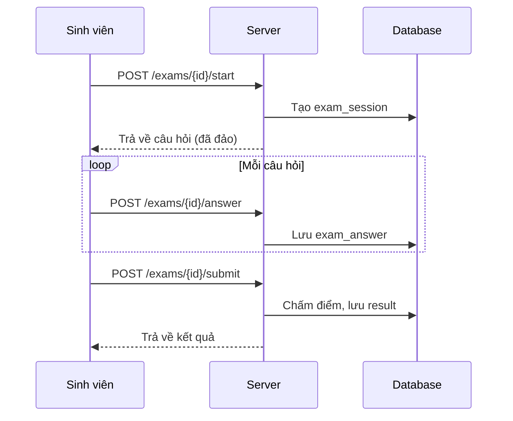

# 🎓 Chức năng Sinh viên

## 📋 Tổng quan

Chức năng dành cho sinh viên bao gồm xem nhóm học phần, làm bài kiểm tra, điểm danh và xem kết quả.

---

## 🎯 Chức năng chính

1. **Dashboard:** Tổng quan các hoạt động
2. **Nhóm học phần:** Xem danh sách nhóm đã đăng ký
3. **Bài kiểm tra:** Xem và làm bài thi
4. **Điểm danh:** Quét QR điểm danh
5. **Kết quả:** Xem lịch sử và điểm số

---

## 🔌 API Endpoints

### Dashboard
| Method | Endpoint | Mô tả |
|--------|----------|-------|
| `GET` | `/api/student/dashboard` | Thông tin tổng quan |

### Course Groups
| Method | Endpoint | Mô tả |
|--------|----------|-------|
| `GET` | `/api/student/course-groups` | Nhóm HP đã đăng ký |
| `GET` | `/api/student/course-groups/{id}` | Chi tiết nhóm HP |

### Exams
| Method | Endpoint | Mô tả |
|--------|----------|-------|
| `GET` | `/api/student/exams` | Danh sách bài thi |
| `POST` | `/api/student/exams/{id}/start` | Bắt đầu làm bài |
| `POST` | `/api/student/exams/{id}/answer` | Nộp câu trả lời |
| `POST` | `/api/student/exams/{id}/submit` | Nộp bài |

### Attendance
| Method | Endpoint | Mô tả |
|--------|----------|-------|
| `POST` | `/api/student/attendance/check-in` | Điểm danh QR |
| `GET` | `/api/student/attendance/history` | Lịch sử điểm danh |

### Results
| Method | Endpoint | Mô tả |
|--------|----------|-------|
| `GET` | `/api/student/results` | Danh sách kết quả |
| `GET` | `/api/student/results/{id}` | Chi tiết kết quả |

---

## 📝 Quy trình Làm bài thi

---

## 📊 Business Rules

1. **Làm bài:**
   - Kiểm tra thời gian hợp lệ (start_date - end_date)
   - Kiểm tra số lần đã làm < max_attempts
   - Auto-submit khi hết thời gian

2. **Điểm danh:**
   - Scan QR trong thời gian hợp lệ
   - Đi muộn > 15 phút: trạng thái "late"

3. **Xem kết quả:**
   - Phụ thuộc cấu hình `show_result` của đề

---

*Cập nhật: 01/2026*
