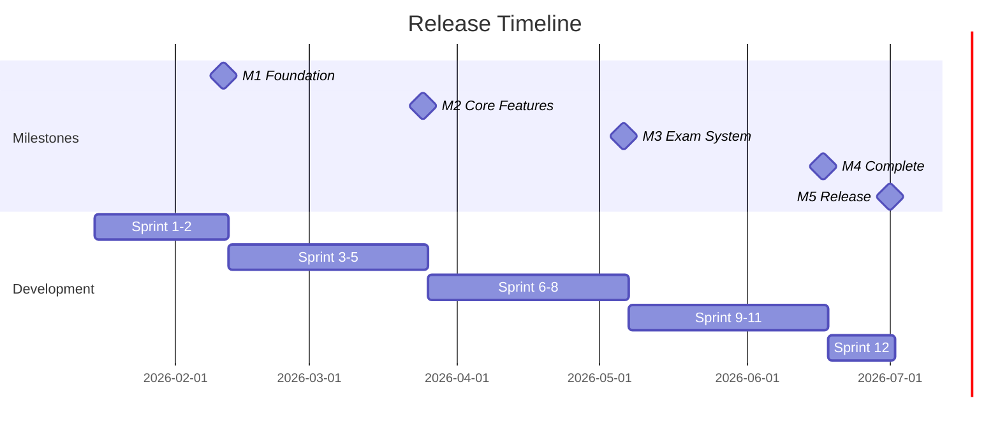

# 🎯 Milestones - Các Mốc Phát triển

## 📅 Tổng quan Timeline

| Milestone | Ngày dự kiến | Trạng thái |
|-----------|--------------|------------|
| M1: Foundation | 2026-02-11 | 🔵 Planned |
| M2: Core Features | 2026-03-25 | 🔵 Planned |
| M3: Exam System | 2026-05-06 | 🔵 Planned |
| M4: Complete Features | 2026-06-17 | 🔵 Planned |
| M5: Production Release | 2026-07-01 | 🔵 Planned |

---

## 🏁 M1: Foundation (Sprint 1-2)

**Ngày hoàn thành dự kiến:** 2026-02-11

### Deliverables
- ✅ Development environment với Podman
- ✅ Laravel API project setup
- ✅ ReactJS frontend setup
- ✅ MySQL database với schema hoàn chỉnh
- ✅ Authentication system (Laravel Sanctum)
- ✅ Role-based access control

### Criteria
- [ ] Tất cả containers chạy ổn định
- [ ] Login/Register hoạt động
- [ ] Database migrations thành công
- [ ] API response chuẩn hóa

---

## 🏁 M2: Core Features (Sprint 3-5)

**Ngày hoàn thành dự kiến:** 2026-03-25

### Deliverables
- ✅ User management (Admin)
- ✅ Subject management với chapters
- ✅ Teaching assignments
- ✅ Question bank với filtering
- ✅ Import/Export câu hỏi

### Criteria
- [ ] CRUD Users hoạt động
- [ ] CRUD Subjects/Chapters hoạt động
- [ ] Admin có thể phân công giảng viên
- [ ] Giảng viên tạo được câu hỏi
- [ ] Import từ Excel thành công

---

## 🏁 M3: Exam System (Sprint 6-8)

**Ngày hoàn thành dự kiến:** 2026-05-06

### Deliverables
- ✅ Course group management
- ✅ QR attendance system
- ✅ Exam creation với auto-generate
- ✅ Question shuffling

### Criteria
- [ ] Giảng viên tạo được nhóm HP
- [ ] Import danh sách sinh viên
- [ ] Tạo QR điểm danh
- [ ] Sinh viên điểm danh qua QR
- [ ] Tạo đề thi tự động từ ngân hàng
- [ ] Đảo câu hỏi và đáp án

---

## 🏁 M4: Complete Features (Sprint 9-11)

**Ngày hoàn thành dự kiến:** 2026-06-17

### Deliverables
- ✅ Online exam taking
- ✅ Auto-grading
- ✅ Student dashboard
- ✅ Results and reports
- ✅ Export results

### Criteria
- [ ] Sinh viên làm bài thi online
- [ ] Timer và auto-submit
- [ ] Chấm điểm tự động
- [ ] Xem kết quả và lịch sử
- [ ] Export điểm ra Excel

---

## 🏁 M5: Production Release (Sprint 12)

**Ngày hoàn thành dự kiến:** 2026-07-01

### Deliverables
- ✅ Full test coverage
- ✅ Bug fixes
- ✅ Production deployment
- ✅ Documentation

### Criteria
- [ ] Unit tests > 80% coverage
- [ ] No critical bugs
- [ ] Production server running
- [ ] SSL configured
- [ ] User documentation complete

---

## 📊 Release Schedule

---

## 📈 Success Metrics

| Metric | Target |
|--------|--------|
| Test Coverage | > 80% |
| API Response Time | < 200ms (95th percentile) |
| Uptime | 99.5% |
| Bug Fix Time | Critical: < 24h, High: < 72h |
| User Satisfaction | > 4.0/5.0 |

---

*Cập nhật: 01/2026*
